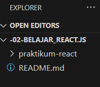
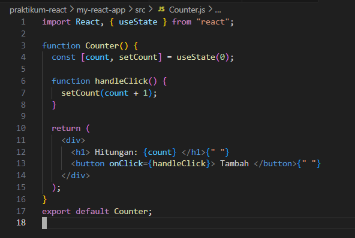
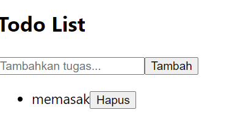

## LAPORAN JOBSHEET-2
**Nama    : Yunila Putmasari**
**Kelas   : 3B**
**NIM     : 2241720062**

### A. Persiapan Lingkungan
1. Pastikan Node.js dan npm sudah terinstal di komputer Anda. Anda dapat memeriksanya dengan menjalankan perintah berikut di terminal atau command prompt:

2. Buat direktori baru untuk proyek React Anda:

3. Inisialisasi proyek React dengan menjalankan perintah berikut:

4. Jalankan aplikasi React dengan perintah : npm start

### B. Membuat Komponen React
1. Buka file src/App.js di text editor Anda.
2. Ganti kode di dalamnya dengan kode berikut untuk membuat komponen sederhana:

3. Simpan file dan lihat perubahan di browser. Anda akan melihat tampilan sederhana dengan header, konten utama, dan footer.

### C. Menggunakan JSX untuk Membuat Komponen Dinamis
1. Buat file baru di direktori src dengan nama Counter.js.
2. Tambahkan kode berikut untuk membuat komponen Counter yang dinamis:

3. Buka file src/App.js dan impor komponen Counter:

4. Tambahkan komponen Counter ke dalam komponen App:

5. Simpan file dan lihat perubahan di browser. Anda akan melihat tombol "Tambah" yang dapat meningkatkan hitungan saat diklik

### D. Menggunakan Props untuk Mengirim Data
1. Buat file baru di direktori src dengan nama Greeting.js.
2. Tambahkan kode berikut untuk membuat komponen Greeting yang menerima props:

3. Buka file src/App.js dan impor komponen Greeting:

4. Tambahkan komponen Greeting ke dalam komponen App dan kirim props name:

5. Simpan file dan lihat perubahan di browser. Anda akan melihat pesan "Halo, John!" yang ditampilkan oleh komponen Greeting.

### E. Menggunakan State untuk Mengelola Data
1. Buka file src/App.js dan tambahkan kode berikut untuk membuat komponen yang mengelola state:

2. Tambahkan komponen Example ke dalam komponen App:

3. Simpan file dan lihat perubahan di browser. Anda akan melihat form input yang dapat mengupdate state dan menampilkan data yang dimasukkan.

### Tugas
1. Buat komponen baru bernama TodoList yang menampilkan daftar tugas (todo list). Gunakan state untuk mengelola daftar tugas dan props untuk mengirim data tugas ke komponen anak.

2. Tambahkan fitur untuk menambahkan tugas baru ke dalam daftar menggunakan form input.

3. Implementasikan fitur untuk menghapus tugas dari daftar

